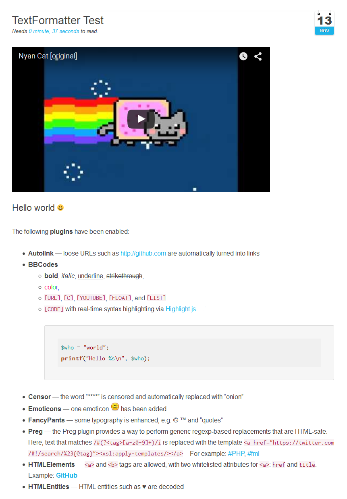

# [][project]

[][project] [][issues] [](LICENSE "License") <span style="float:right;">[][flattr] [][paypal]</span>

> This plugin is a wrapper for [TextFormatter](https://github.com/s9e/TextFormatter), a library that supports BBCode, HTML and other markup via plugin. Handles emoticons, censors words, automatically embeds media and more.

##### Table of Contents:

* [About](#about)
* [Installation and Updates](#installation-and-updates)
* [Usage](#usage)
    * [Example](#example)
    * [Known issues](#known-issues)
    * [Twig Filter](#twig-filter)
* [Contributing](#contributing)
* [License](#license)

## About

`TextFormatter` is a high-quality plugin for [GetGrav.org](http://getgrav.org) extending it's page processing options by using the [TextFormatter](https://github.com/s9e/TextFormatter) library. It supports BBCode, Markdown, HTML and other markup via plugins. The library is in PHP, with a JavaScript port also available for client-side preview. It comes with a [thorough documentation](http://s9etextformatter.readthedocs.org/) and has a rich feature set already natively supported. This plugin exposes almost all options of them and gives you the full control over the configurations in the admin panel or in the page header.

If you are interested in in seeing this plugin in action you can [tryout a demonstration](http://s9e.github.io/TextFormatter/demo.html). Here is a screenshot on a live system:



## Installation and Updates

Installing or updating the `TextFormatter` plugin can be done in one of two ways. Using the GPM (Grav Package Manager) installation update method (i.e. `bin/gpm install textformatter`) or manual install by downloading [this plugin](https://github.com/sommerregen/grav-plugin-textformatter) and extracting all plugin files to

    user/plugins/textformatter

For more informations, please check the [Installation and update guide](docs/INSTALL.md).

## Usage

The `TextFormatter` plugin comes with some sensible default configuration, that are pretty self explanatory:

### Config Defaults

```yaml
# Global plugin configurations

enabled: true                # Set to false to disable this plugin completely

# Default options for TextFormatter configuration

process: false

# Global and page specific configurations

autoemail: true               # Convert plain-text emails into clickable "mailto:" links
autoimage: true               # Converts plain-text image URLs into actual images

# Converts plain-text URLs into clickable links
autolink:
  enabled: true
  www: false                  # Autom. link any hostname that starts with "www."

  schemes:                    # Allowed schemes
    - 'http'
    - 'https'

# Handle a very flexible flavour of the BBCode syntax.
bbcodes:
  enabled: true

  # Add BBCodes from repository (https://github.com/s9e/TextFormatter/blob/master/src/Plugins/BBCodes/Configurator/repository.xml)
  bbcodes: ['b', 'c', 'center', 'code', 'color', 'email', 'float', 'hr', 'i', 'img', 'list', '*', 'quote', 's', 'size', 'spoiler', 'u', 'url']

  custom:
    # <bbcode>: <template>

# Censors text based on a configurable list of words
censor:
  enabled: true

  words:
    # <word>: <replacement>

# Render standardized set of pictographs.
emoji: ''                     # Currently support: 'twemoji', 'emojione'

# Performs simple replacements, best suited for handling emoticons. Matching is case-sensitive.
emoticons:
  enabled: true

  path: ''
  icons:
    # <acronym>: <filename.extension>

# Defines the backslash character \ as an escape character
escaper:
  enabled: true

  escape_all: false           # Escape any character (only suitable in some specific situations)

  regex: ''                   # Escape according to regular expression

fancypants: true              # Provide enhanced typography, aka "fancy Unicode symbols"

# Allows HTML comments to be used, enables a whitelist of HTML elements and escapes HTML entities
html:
  comments: true              # Allow HTML comments to be used
  entities: true              # Allow HTML entities to be used.

  # Enables a whitelist of HTML elements to be used
  elements:
    enabled: true

    allowed:
      safe:                     # Allow some safe HTML
        a: 'href, *title'
        abbr: '*title'
        b: ''
        br: ''
        code: ''
        dd: ''
        del: ''
        div: '*class'
        dl: ''
        dt: ''
        i: ''
        img: 'src, *alt, *height, *title, *width'
        ins: ''
        li: ''
        ol: ''
        pre: ''
        rb: ''
        rp: ''
        rt: ''
        rtc: ''
        ruby: ''
        span: '*class'
        strong: ''
        sub: ''
        sup: ''
        table: ''
        tbody: ''
        td: '*colspan, *rowspan'
        tfoot: ''
        th: '*colspan, *rowspan, *scope'
        thead: ''
        tr: ''
        u: ''
        ul: ''

      unsafe:                   # Allow unsafe HTML (danger!)

# Serves to capture keywords in plain text and render them as a rich element
# of your choosing such as a link, a popup or a widget.
keywords:
  enabled: true
  case_sensitive: true        # Keywords are case-sensitive by default
  template: ''                # Template to render keywords

  keywords:                   # Add a couple of keywords

# Allow the user to embed content from allowed sites using a [media]
# BBCode, site-specific BBCodes such as [youtube], or from simply posting
# a supported URL in plain text.
mediaembed:
  enabled: true

  # Whether to create a BBCode for each site
  create_individiual_bbcodes: true

  # Add the sites you want to support
  # see http://s9etextformatter.readthedocs.org/Plugins/MediaEmbed/Sites/
  sites:
    - 'dailymotion'
    - 'facebook'
    - 'flickr'
    - 'imgur'
    - 'instagram'
    - 'slideshare'
    - 'soundcloud'
    - 'spotify'
    - 'tumblr'
    - 'twitch'
    - 'twitter'
    - 'vimeo'
    - 'vine'
    - 'youtube'

# Performs generic, regexp-based replacements
preg:
  enabled: true

  replace:
    # <pattern>: <replacement>

  match:
    # <pattern>: <tagname>
```

If you need to change any value, then the best process is to copy the [textformatter.yaml](textformatter.yaml) file into your `users/config/plugins/` folder (create it if it doesn't exist), and then modify there. This will override the default settings.

If you want to alter the settings for one or a few pages only, you can do so by adding page specific configurations into your page headers, e.g.

```yaml
textformatter: false
```

to switch off `TextFormatter` plugin just for this page or

```yaml
textformatter:
  bbcodes:
    enabled: false

```

to temporarily disable BBCodes for the current page. By default `TextFormatter` only formats text inside Grav specific links:

```markdown
[plugin:textformatter](...)
```

If you like to process the entire page with `TextFormatter` you may set

```yaml
process:
  textformatter: true

```

in your page header.

### Known issues

The [Parsedown libary](https://github.com/erusev/parsedown-extra) used by Grav to parse Markdown doesn't handle HTML elements very well. In some cases when block elements are on one line, all content below will be ignored (see the issue [#44](https://github.com/erusev/parsedown-extra/issues/44) for some details). However only `Parsedown Extra` is affected. Rendering content in regular `Parsedown` is fine.

If you experience such an issues, it is recommended to disable `Parsedown Extra` in the page header via

```yaml
markdown:
  extra: false
```

and use Twig instead, if necessary.

### Twig Filter

`TextFormatter` provides a Twig filter to process contents by the [TextFormatter library](https://github.com/s9e/TextFormatter). To do that, place the following line of code in the theme file you wish to add the `TextFormatter` plugin for:

```
{{ page.content|textformatter }}
```

You can pass arguments to the plugin filter, namely the same arguments as available in the [textformatter.yaml](textformatter.yaml) file. For example

```
{{ page.content|textformatter({'bbcodes': {'enabled' : false}}) }}
```

will disable the support for BBCodes.

## Contributing

You can contribute at any time! Before opening any issue, please search for existing issues and review the [guidelines for contributing](docs/CONTRIBUTING.md).

After that please note:

* If you find a bug, would like to make a feature request or suggest an improvement, [please open a new issue][issues]. If you have any interesting ideas for additions to the syntax please do suggest them as well!
* Feature requests are more likely to get attention if you include a clearly described use case.
* If you wish to submit a pull request, please make again sure that your request match the [guidelines for contributing](docs/CONTRIBUTING.md) and that you keep track of adding unit tests for any new or changed functionality.

### Support and donations

If you like my project, feel free to support me via [][flattr] or by sending me some bitcoins to [**1HQdy5aBzNKNvqspiLvcmzigCq7doGfLM4**][bitcoin].

Thanks!

## License

Copyright (c) 2015 [Benjamin Regler][github]. See also the list of [contributors] who participated in this project.

[Dual-licensed](LICENSE) for use under the terms of the [MIT][mit-license] or [GPLv3][gpl-license] licenses.

![GNU license - Some rights reserved][gnu]

[github]: https://github.com/sommerregen/ "GitHub account from Benjamin Regler"
[gpl-license]: http://opensource.org/licenses/GPL-3.0 "GPLv3 license"
[mit-license]: http://www.opensource.org/licenses/mit-license.php "MIT license"

[flattr]: https://flattr.com/submit/auto?user_id=Sommerregen&url=https://github.com/sommerregen/grav-plugin-textformatter "Flatter my GitHub project"
[paypal]: https://www.paypal.com/cgi-bin/webscr?cmd=_s-xclick&hosted_button_id=SYFNP82USG3RN "Donate for my GitHub project using PayPal"
[bitcoin]: bitcoin:1HQdy5aBzNKNvqspiLvcmzigCq7doGfLM4?label=GitHub%20project "Donate for my GitHub project using BitCoin"
[gnu]: https://upload.wikimedia.org/wikipedia/commons/thumb/3/33/License_icon-gpl-88x31.svg/88px-License_icon-gpl-88x31.svg.png "GNU license - Some rights reserved"

[project]: https://github.com/sommerregen/grav-plugin-textformatter
[issues]: https://github.com/sommerregen/grav-plugin-textformatter/issues "GitHub Issues for Grav TextFormatter Plugin"
[contributors]: https://github.com/sommerregen/grav-plugin-textformatter/graphs/contributors "List of contributors of the project"
